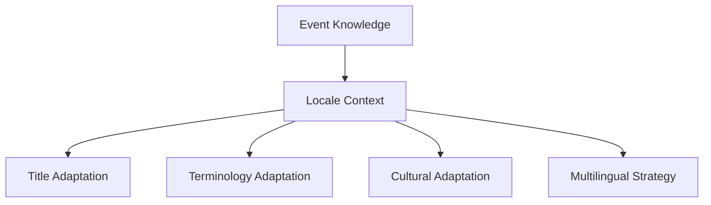

# Localization Reasoning

## Purpose

Localization Reasoning explains how content decisions change across languages, regions, and cultures. It defines how titles, terminology, cultural adaptations, and future multilingual strategy should work.

## Overview

Localization is not translation after generation. It is reasoning about what the audience will understand, trust, search for, and act on.

## Architecture

Localization reasoning adapts meaning while preserving truth. It should influence titles, narration, overlays, observation advice, units, examples, cultural references, and platform metadata.

## Responsibilities

- Adapt titles for natural language, platform behavior, and audience expectation.
- Choose terminology that is accurate and familiar.
- Adjust cultural framing without changing scientific meaning.
- Preserve event timing, location, and visibility constraints.
- Support future multilingual content strategy.
- Evaluate localized outputs for both correctness and usefulness.

## Decision Logic

### How titles change

Titles change by adapting the viewer promise, not merely word order. A localized title may:

- Use a familiar event name.
- Move the date or viewing instruction earlier.
- Replace technical phrasing with audience-friendly language.
- Preserve urgency only when the event is actually time-sensitive.
- Avoid idioms that do not transfer across languages.

### How terminology changes

Terminology is selected by audience fit:

| Term type | Reasoning approach |
| --- | --- |
| Scientific term | Use when needed for accuracy, define if unfamiliar. |
| Common sky-watching term | Prefer when it improves comprehension. |
| Region-specific term | Use when it improves trust and cultural fit. |
| Transliterated term | Use only when more recognizable than a literal translation. |

### How cultural adaptations work

Cultural adaptation may change examples, metaphors, units, and framing. It must not change astronomical facts. For example, a festival reference may make a Moon event feel familiar, but the content should not imply a scientific relationship unless one exists.

### Future multilingual strategy

Future multilingual reasoning should support:

- Language-specific title formulas.
- Locale-specific sky visibility and time expression.
- Regional observing norms and safety emphasis.
- Voice, typography, and script-aware layout rules.
- Search metadata optimized per language.
- Human review tiers for high-impact locales.

## Examples

- An English title may emphasize "total lunar eclipse," while a Hindi title may combine the familiar Moon term with a concise explanation of the red color.
- A solar eclipse script should adapt safety wording to local norms but never weaken filter requirements.
- A region where the event is not visible should receive an explanation or simulation framing rather than a direct viewing promise.

## Future Improvements

- Locale-specific reasoning profiles.
- Multilingual terminology databases linked to knowledge contracts.
- Cultural sensitivity review for metaphors and references.
- Search-performance feedback by language and region.

## Related Documents

- [Reasoning Architecture](./ReasoningArchitecture.md)
- [Quality Reasoning](./QualityReasoning.md)
- [Knowledge Localization](../knowledge/KnowledgeLocalization.md)
- [Localization Engine](../product/LocalizationEngine.md)
