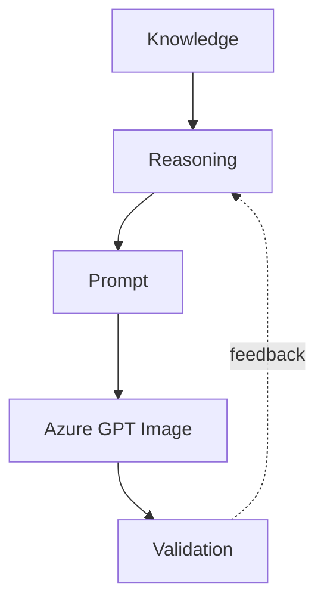
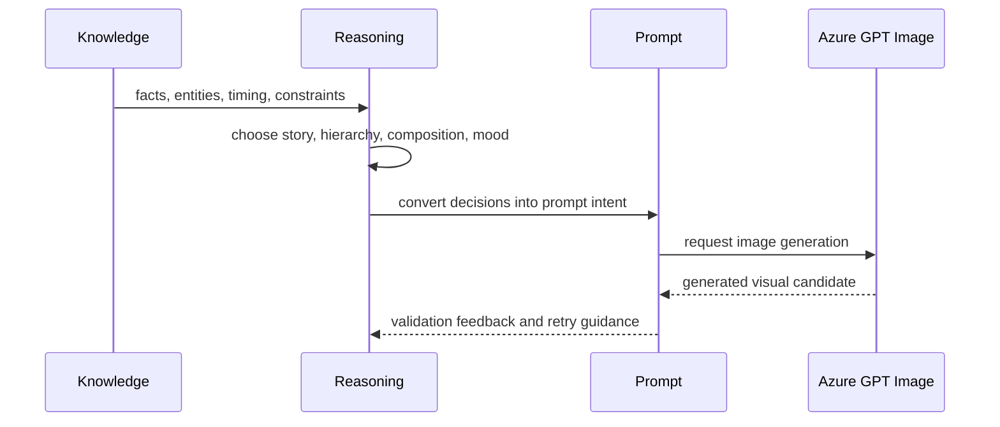

# Prompt Reasoning

## Purpose

Prompt Reasoning explains how reasoning decisions become provider-facing prompts. It defines the conceptual bridge from knowledge to reasoning to prompt to Azure GPT Image without turning this documentation into implementation details.

## Overview

A prompt should be the final expression of prior decisions, not the place where the platform first thinks. Prompt quality depends on upstream reasoning quality.

## Architecture

Prompt reasoning packages decisions into generation intent:

- What the image must show.
- What visual hierarchy should be preserved.
- What style and mood support the story.
- What scientific constraints must not be violated.
- What format or aspect ratio is required.
- What should be avoided.

## Responsibilities

- Translate story and visual reasoning into concise generation direction.
- Preserve knowledge constraints inside prompt language.
- Include negative constraints for common astronomy mistakes.
- Adapt prompt emphasis to hero, thumbnail, scene, diagram, or background use.
- Keep provider prompts aligned with validation expectations.
- Avoid hiding critical decisions inside provider-specific phrasing only.

## Decision Logic

Prompt reasoning follows this sequence:

The prompt should be specific enough to guide generation but not so overloaded that the main visual idea is diluted.

## Examples

### Lunar eclipse hero

- Knowledge: eclipse, Moon, Earth's shadow, visible night context.
- Reasoning: dominant red Moon with shadow mood and readable sky context.
- Prompt direction: cinematic red eclipsed Moon, realistic night sky, subtle horizon, no impossible giant scale, no unrelated planets.

### Meteor shower thumbnail

- Knowledge: meteor shower, radiant direction, dark-sky viewing.
- Reasoning: wide dark sky, several subtle meteors, high contrast, simple composition.
- Prompt direction: dark-sky scene with visible meteor streaks, strong empty space for text, no exploding fireballs.

### Planet conjunction

- Knowledge: two planets appear close from Earth.
- Reasoning: apparent proximity, not collision or physical pairing.
- Prompt direction: realistic sky view with two bright points near each other, grounded horizon context, no sci-fi planetary collision.

## Future Improvements

- Store prompt reasoning traces alongside generated assets.
- Generate multiple prompt variants from the same reasoning decision.
- Score prompts before generation for clarity, constraint coverage, and hallucination risk.
- Add provider-specific adapters while keeping provider-neutral reasoning stable.

## Related Documents

- [Reasoning Architecture](./ReasoningArchitecture.md)
- [Visual Reasoning](./VisualReasoning.md)
- [Quality Reasoning](./QualityReasoning.md)
- [Prompt Engine](../product/PromptEngine.md)
