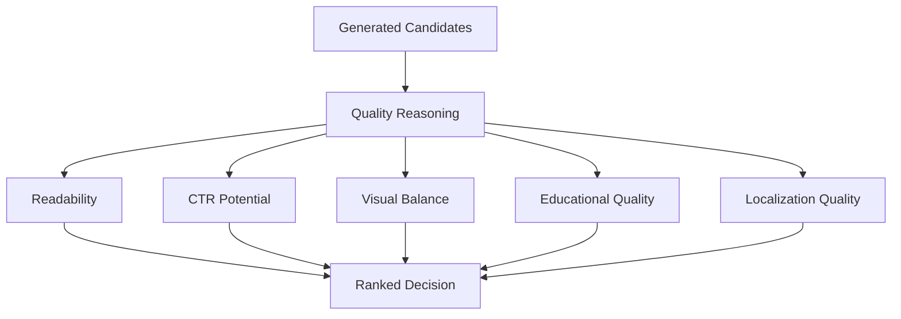

# Quality Reasoning

## Purpose

Quality Reasoning explains how the platform decides that one content option is better than another. It covers hero image selection, readability, click-through potential, visual balance, educational quality, and localization quality.

## Overview

Quality is a reasoning problem because many outputs can be valid while only a few are excellent. The platform needs principles for ranking acceptable candidates.

## Architecture

Quality reasoning evaluates outputs against both objective and product-facing criteria. It should explain not only whether an asset passes, but why one candidate is stronger.

## Responsibilities

- Compare hero, thumbnail, narration, title, and prompt candidates.
- Identify readability problems before publishing.
- Balance engagement and truthfulness.
- Detect visual clutter, weak hierarchy, or misleading imagery.
- Evaluate educational completeness and usefulness.
- Evaluate localization fit beyond literal translation.

## Decision Logic

### Why one Hero is better than another

A hero is better when it:

- Communicates the event family instantly.
- Has a clear dominant object.
- Uses supporting objects to add context rather than clutter.
- Leaves safe space for overlays where needed.
- Matches the story angle and title promise.
- Avoids misleading scale, color, or geometry.
- Works at both full-size and preview scale.

### Readability

Readability considers:

- Contrast between subject, text, and background.
- Number of competing focal points.
- Safe margins for platform cropping.
- Text complexity and line length.
- Recognition at mobile size.

### CTR

CTR reasoning should improve curiosity without deception. Strong CTR comes from a specific promise, clear subject, and emotional or visual tension. Weak CTR comes from generic titles, cluttered thumbnails, or claims that overstate rarity or danger.

### Visual balance

Visual balance evaluates the relationship between primary object, negative space, horizon, color contrast, and motion cues. A balanced composition directs attention without making the image feel empty or chaotic.

### Educational quality

Educational quality asks whether the asset teaches the right thing for the format. A short thumbnail might teach through one clear visual contrast, while a narration segment can include mechanism and observation advice.

### Localization quality

Localization quality checks whether titles, overlays, and narration feel natural for the target audience. A literal translation may pass language correctness but fail cultural comprehension or platform norms.

## Examples

| Candidate issue | Quality reasoning outcome |
| --- | --- |
| Hero shows a giant meteor hitting Earth for a meteor shower. | Reject or downgrade because it misrepresents observable meteors. |
| Lunar eclipse title says "Moon disappears forever." | Reject because CTR is deceptive and scientifically false. |
| Hindi title uses technically correct but uncommon terminology. | Downgrade because localization is less natural. |
| Thumbnail has six objects of equal brightness. | Downgrade because visual hierarchy is weak. |

## Future Improvements

- Numeric quality scoring for readability, CTR, visual balance, education, and localization.
- Learned ranking from publishing performance.
- Automated small-size thumbnail preview scoring.
- Human review feedback loops that update quality weights.

## Related Documents

- [Reasoning Architecture](./ReasoningArchitecture.md)
- [Visual Reasoning](./VisualReasoning.md)
- [Educational Reasoning](./EducationalReasoning.md)
- [Localization Reasoning](./LocalizationReasoning.md)
