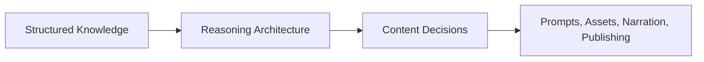

# Reasoning Documentation

## Purpose

The reasoning documentation defines the intelligence layer of Astronomy V3 RC2: the layer that transforms structured knowledge into content decisions before generation begins.

This is not implementation documentation. It describes how the platform should think, choose, rank, adapt, and validate ideas for astronomy media.

## Overview

Astronomy V3 RC2 now has foundation, architecture, event families, product modules, platform strategy, and knowledge documentation. Reasoning sits between knowledge and generation.

## Architecture

Reasoning consumes validated knowledge and produces decision intent. It does not replace knowledge, execute rendering, call providers, or publish content. It explains why one story, visual, title, prompt direction, thumbnail concept, or educational sequence is better than another.

## Responsibilities

- Convert event facts into story choices.
- Convert visual intent into composition choices.
- Convert educational goals into learning sequences.
- Convert reasoning decisions into prompt-ready direction.
- Rank alternatives using quality criteria.
- Adapt content for language, region, culture, and platform.
- Provide the conceptual blueprint for the future AI Director.

## Decision Logic

Reasoning evaluates candidate content directions against audience value, factual fit, visual clarity, educational usefulness, localization quality, and publishing suitability.

## Examples

- A lunar eclipse may be framed as a "why the Moon turns red" story instead of a generic event announcement.
- A meteor shower hero may prioritize the radiant and sky context over a close-up meteor illustration.
- A Hindi title may use familiar sky-watching terminology rather than literal English word order.

## Future Improvements

Future releases should connect this layer to measurable AI Director outputs: confidence scores, ranked alternatives, automated thumbnail evaluation, narration scoring, and publishing recommendations.

## Related Documents

- [Reasoning Architecture](./ReasoningArchitecture.md)
- [Story Reasoning](./StoryReasoning.md)
- [Visual Reasoning](./VisualReasoning.md)
- [Educational Reasoning](./EducationalReasoning.md)
- [Prompt Reasoning](./PromptReasoning.md)
- [Quality Reasoning](./QualityReasoning.md)
- [Localization Reasoning](./LocalizationReasoning.md)
- [Decision Engine](./DecisionEngine.md)
- [Content Intelligence](./ContentIntelligence.md)
- [Knowledge Architecture](../knowledge/KnowledgeArchitecture.md)
- [Product Modules](../product/README.md)
