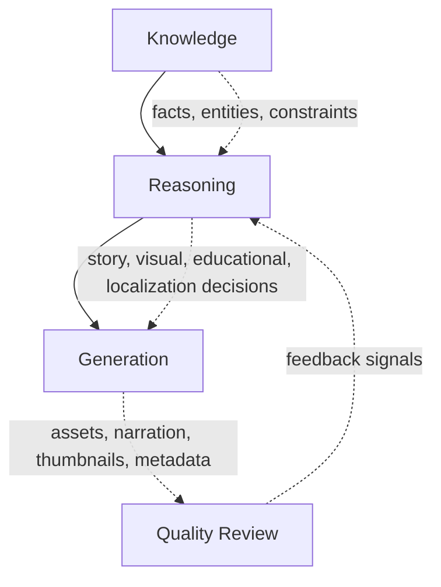
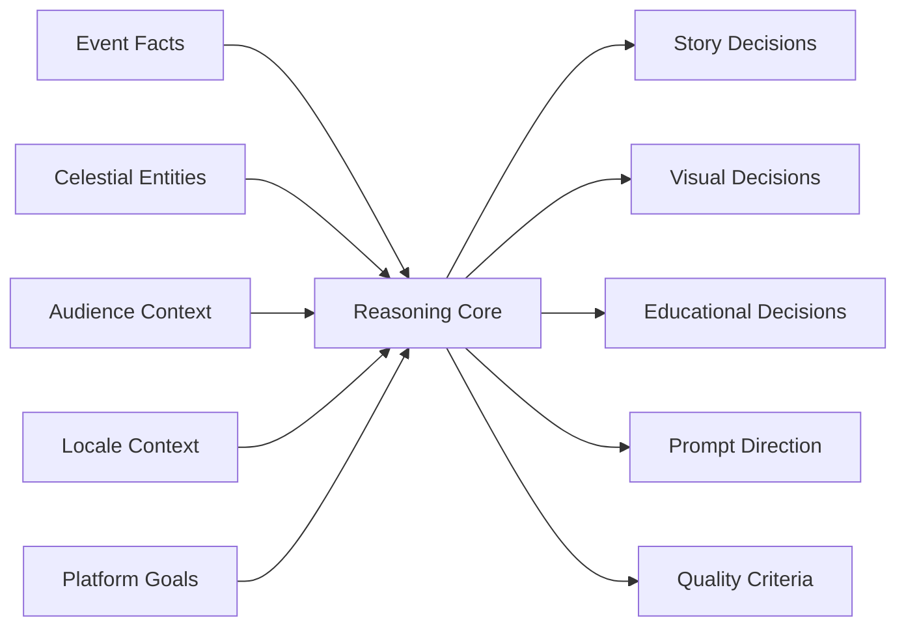
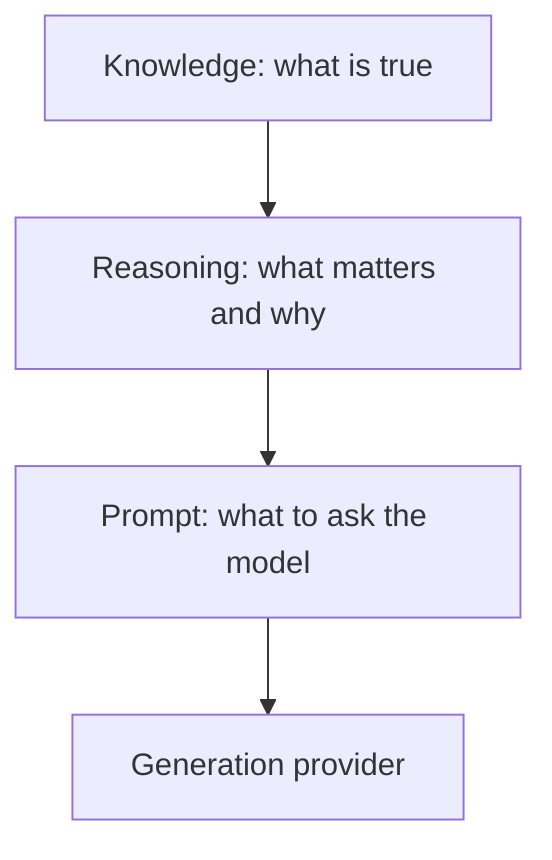

# Reasoning Architecture

## Purpose

Reasoning Architecture defines the intelligence layer that transforms structured astronomy knowledge into content decisions. It explains why reasoning exists, how it differs from knowledge and prompts, and how it becomes the blueprint for a future AI Director.

Reasoning exists because correct facts alone do not create compelling media. The platform must decide what matters most, what the viewer should notice first, what order ideas should appear in, how the event should look, and how confidence should be assigned to competing creative choices.

## Overview

The core architecture is:

Knowledge says what is true. Reasoning decides what should be emphasized. Generation turns those decisions into concrete assets.

## Architecture

The reasoning layer is conceptual and product-facing. It should be stable even if implementation changes from rules to heuristics, model calls, retrieval systems, or hybrid AI agents.

## Responsibilities

- Interpret structured knowledge into audience-facing content intent.
- Select the strongest narrative angle for an event.
- Decide visual priority, hierarchy, tone, and composition.
- Sequence educational ideas so viewers learn progressively.
- Convert decisions into prompt-ready guidance without becoming a prompt template.
- Rank alternatives by quality, confidence, and platform fit.
- Preserve scientific accuracy while improving curiosity and engagement.

## Decision Logic

Reasoning compares candidates using questions such as:

| Question | Reasoning concern |
| --- | --- |
| What is the most meaningful fact? | Story emphasis |
| What should the viewer notice first? | Visual hierarchy |
| What does the audience need to understand before the reveal? | Educational sequencing |
| What language or cultural framing improves comprehension? | Localization |
| What could mislead the viewer? | Accuracy and safety |
| Which option is most clickable without becoming deceptive? | Quality and publishing fit |

## Knowledge vs Reasoning vs Prompt

| Layer | Definition | Owns | Does not own |
| --- | --- | --- | --- |
| Knowledge | Structured, validated context about the event and domain. | Facts, entities, timing, visibility, constraints, terminology. | Creative emphasis or provider-specific wording. |
| Reasoning | Decision layer that interprets knowledge into content intent. | Priorities, rankings, narrative angle, visual strategy, confidence. | Rendering, direct publishing, provider execution. |
| Prompt | Provider-facing instruction derived from reasoning. | Compact generation request, style constraints, negative constraints. | Source truth, full decision history, final validation. |

## Examples

- Knowledge: A total lunar eclipse is visible in a region at a specific time. Reasoning: viewers will understand it best through the shadow-and-red-Moon explanation. Prompt: generate a cinematic red Moon above a recognizable horizon with accurate eclipse context.
- Knowledge: A meteor shower peaks after midnight. Reasoning: the useful story is where to look and why dark skies matter. Prompt: show a wide dark-sky composition with radiant direction and subtle meteors.
- Knowledge: A conjunction has two named planets separated by a small angular distance. Reasoning: the hero should emphasize proximity in the sky rather than physical closeness in space.

## Future Improvements

- Add machine-readable reasoning traces for auditability.
- Introduce confidence scoring across story, visual, educational, and localization decisions.
- Use audience feedback to update reasoning weights.
- Allow AI Director agents to propose alternatives while validation enforces knowledge contracts.

## Related Documents

- [Knowledge Architecture](../knowledge/KnowledgeArchitecture.md)
- [Story Reasoning](./StoryReasoning.md)
- [Visual Reasoning](./VisualReasoning.md)
- [Prompt Reasoning](./PromptReasoning.md)
- [Decision Engine](./DecisionEngine.md)
