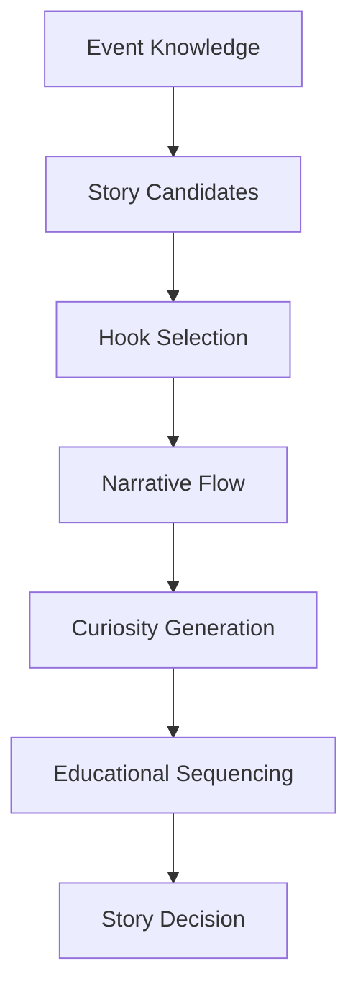

# Story Reasoning

## Purpose

Story Reasoning explains how the platform selects and organizes astronomy stories from structured knowledge. It defines how a fact becomes a hook, how the hook becomes a narrative flow, and how the final content creates curiosity while preserving scientific clarity.

## Overview

Astronomy stories should not be simple lists of facts. They should guide viewers from attention to understanding to action.

## Architecture

Story reasoning evaluates candidate angles from the event family, audience context, and platform goal. A single event can support multiple stories, but the selected story should match the strongest viewer promise.

Common story angles include:

- What is happening in the sky.
- Why the event is rare or timely.
- How to observe it.
- What science explains it.
- What makes it visually memorable.
- Why this event matters compared with ordinary nights.

## Responsibilities

- Select the best story angle for an event.
- Choose a hook that is accurate and emotionally compelling.
- Define beginning, middle, and end beats.
- Introduce curiosity without exaggeration.
- Sequence educational ideas from simple to deeper concepts.
- Preserve event-family identity across narration, hero, thumbnail, and title.

## Decision Logic

### Hook selection

The hook is selected by ranking candidate openings against:

| Criterion | Meaning |
| --- | --- |
| Timeliness | Does the hook make the event feel worth watching now? |
| Specificity | Does it mention the distinctive event, object, or observing condition? |
| Clarity | Can a casual viewer understand the promise quickly? |
| Accuracy | Does it avoid false rarity, scale, or visibility claims? |
| Curiosity | Does it create a question the content can answer? |

### Narrative flow

A strong astronomy narrative usually follows this sequence:

1. **Recognition:** name the event in plain language.
2. **Importance:** explain why this occurrence is worth attention.
3. **Mechanism:** show or explain what causes it.
4. **Observation:** tell viewers when, where, and how to watch.
5. **Takeaway:** leave one memorable scientific or practical insight.

### Curiosity generation

Curiosity should emerge from genuine knowledge gaps:

- Why does the Moon change color during an eclipse?
- Why do meteors appear to radiate from one point?
- Why can two planets look close while being far apart in space?
- Why is dark-sky timing more important than simply knowing the date?

### Educational sequencing

Story reasoning introduces concepts in dependency order. A viewer should not be asked to understand angular separation before first understanding that sky positions are apparent positions from Earth.

## Examples

| Event | Weak story | Stronger story reasoning |
| --- | --- | --- |
| Lunar eclipse | "Lunar eclipse tonight." | "Tonight, Earth's shadow turns the Moon red; here is why and when to look." |
| Meteor shower | "Many meteors will appear." | "The best view comes after midnight because your location turns into the meteor stream." |
| Planet conjunction | "Two planets are close." | "They appear close in our sky, but the story is perspective, not physical distance." |
| Supermoon | "The Moon is bigger." | "The Moon appears slightly larger and brighter because it is near perigee." |

## Future Improvements

- Automated hook selection from event-family templates and engagement history.
- Story A/B ranking for title, thumbnail, and narration alignment.
- Audience-specific pacing for beginners, enthusiasts, children, and educators.
- Confidence-scored story alternatives with validation explanations.

## Related Documents

- [Reasoning Architecture](./ReasoningArchitecture.md)
- [Educational Reasoning](./EducationalReasoning.md)
- [Quality Reasoning](./QualityReasoning.md)
- [Content Intelligence](./ContentIntelligence.md)
