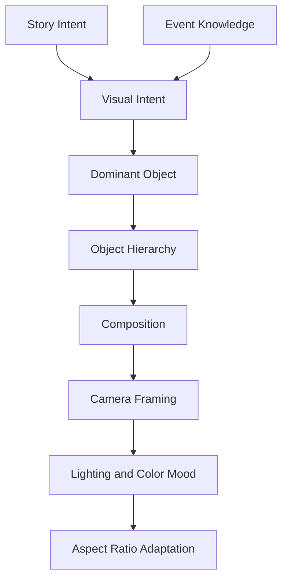
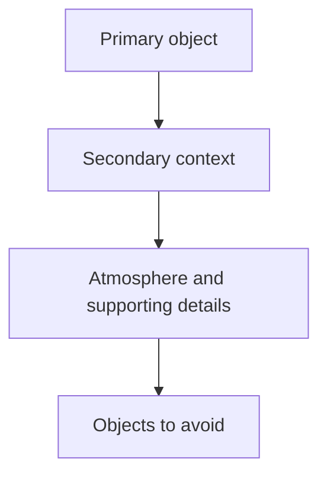

# Visual Reasoning

## Purpose

Visual Reasoning explains how the platform decides what generated astronomy content should look like. It turns knowledge and story intent into visual decisions: dominant object, hierarchy, composition, framing, lighting, color mood, and aspect-ratio adaptation.

## Overview

Visual quality is not only aesthetics. Astronomy visuals must communicate the correct event, guide attention, fit platform formats, and avoid misleading scale or impossible scenes.

## Architecture

Visual reasoning evaluates the image as a communication system. Every major object should have a reason to exist, a priority, and a relationship to the selected story.

## Responsibilities

- Decide the dominant visual object.
- Rank supporting objects by narrative importance.
- Define spatial relationships and visual hierarchy.
- Select composition and camera framing.
- Choose lighting and color mood that support the event family.
- Adapt visuals for 16:9, 9:16, 1:1, thumbnails, hero images, and shorts.
- Prevent visually attractive but scientifically misleading compositions.

## Decision Logic

### Dominant object

The dominant object is the first thing viewers should understand. It is chosen from the story promise:

- Eclipse story: Moon, Sun, shadow geometry, or observer horizon.
- Meteor shower story: dark sky, radiant region, meteor trails, ground silhouette.
- Conjunction story: paired planets and visible separation.
- Comet story: comet nucleus, tail direction, sky context.

### Object hierarchy

Hierarchy prevents clutter. A hero image should not make all objects equally important.

### Composition

Composition choices answer:

- Should the scene be centered, diagonal, panoramic, or vertical?
- Should the horizon provide scale?
- Is the event better shown as realistic observation or explanatory diagram?
- Where should text-safe negative space exist?

### Camera framing

Framing depends on event meaning:

- Wide framing for meteor showers and sky context.
- Medium framing for conjunctions with recognizable separation.
- Close framing for lunar surface or eclipse color.
- Diagrammatic framing for orbital or shadow explanations.

### Lighting

Lighting reinforces truth and mood:

- Night-sky events should preserve dark-sky contrast.
- Solar events require safe, filtered, or diagrammatic treatment.
- Horizon scenes should reflect plausible twilight or nighttime conditions.

### Color mood

Color mood should be expressive but grounded:

- Lunar eclipse: copper, red, umber, deep black.
- Meteor shower: cool blues, dark violet, subtle streaks.
- Aurora or atmospheric events: high saturation only when event knowledge supports it.
- Educational diagrams: clean contrast and readable labeling priority.

### Aspect ratio adaptation

Aspect ratio adaptation is not cropping alone. The same reasoning must be re-applied to each frame:

| Format | Visual reasoning priority |
| --- | --- |
| 16:9 | Story context, horizon, wide sky relationships. |
| 9:16 | Strong central object, vertical attention path, mobile readability. |
| 1:1 | Balanced hierarchy and clear thumbnail recognition. |
| Thumbnail | High contrast, fewer objects, readable subject at small size. |

## Examples

- For a meteor shower short, the radiant and dark sky should dominate; a giant foreground meteor would misrepresent observation.
- For a conjunction thumbnail, the planets should appear close in the sky but not physically colliding.
- For a lunar eclipse hero, color and shadow are more important than unrelated stars or decorative nebulae.

## Future Improvements

- Automated visual ranking against event-family visual standards.
- Learned composition scoring from high-performing assets.
- Multi-aspect prompt variants created from one visual reasoning trace.
- Accessibility scoring for contrast, text-safe areas, and object recognizability.

## Related Documents

- [Reasoning Architecture](./ReasoningArchitecture.md)
- [Prompt Reasoning](./PromptReasoning.md)
- [Quality Reasoning](./QualityReasoning.md)
- [Content Intelligence](./ContentIntelligence.md)
